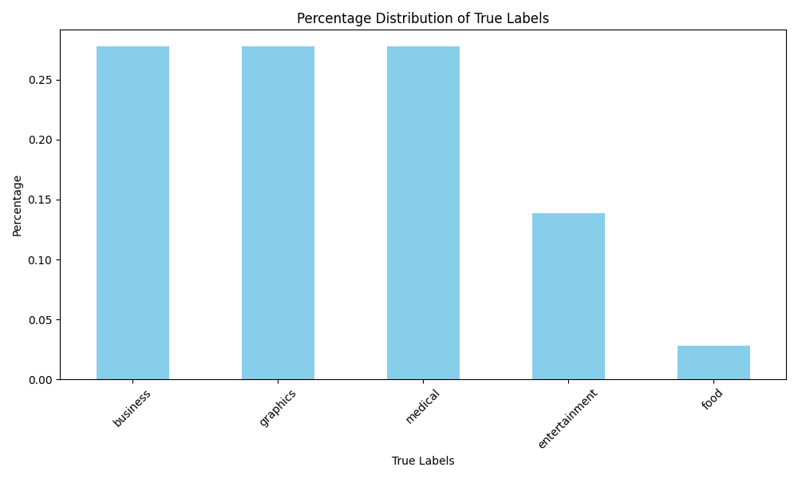

# Efficient Concept-based Mining Model for Enhancing Text Clustering

Welcome to our project on enhancing text clustering using a concept-based mining model! This model leverages word co-occurrences to improve the clustering of text data.

## Overview

Text clustering is an essential task in natural language processing (NLP), where similar documents are grouped together based on their content. However, traditional clustering methods may not capture the underlying concepts effectively. Our approach utilizes word co-occurrences to extract meaningful concepts from the text data, thereby enhancing the clustering process.

## How It Works

1. **Data Preprocessing:**
   - The text data undergoes preprocessing steps such as tokenization, removing stopwords, and stemming to prepare it for analysis.

2. **Word Co-occurrence Matrix:**
   - We construct a word co-occurrence matrix based on the frequency of words appearing together in the text corpus. This matrix captures the relationships between words and provides insights into the underlying concepts.

3. **Concept-based Mining:**
   - Using techniques such as latent semantic analysis (LSA) or non-negative matrix factorization (NMF), we identify latent concepts within the word co-occurrence matrix. These concepts represent clusters of related words that convey meaningful information.

4. **Text Clustering Enhancement:**
   - The extracted concepts are integrated into the text clustering process to improve the accuracy and interpretability of the clusters. By incorporating semantic information, the clustering algorithm can better distinguish between different topics or themes present in the text data.

## Features

- Efficient extraction of concepts from text data using word co-occurrences.
- Integration of concepts to enhance traditional text clustering algorithms.
- Improved clustering accuracy and interpretability.
- Scalable to large text datasets.

## Getting Started

To use our concept-based mining model, follow these steps:

1. **Clone the Repository:**
   ```bash
   git clone https://github.com/yourusername/text-clustering-concepts.git
   ```

2. **Install Dependencies:**
   ```bash
   pip install -r requirements.txt
   ```

3. **Run the Demo:**
   - Execute the demo script to see the model in action.
   ```bash
   python demo.py
   ```

## Demo





## Contributing

We welcome contributions from the community! If you'd like to contribute to the project, please fork the repository and submit a pull request with your changes.

## Support

If you encounter any issues or have any questions about the model, please feel free to open an issue on GitHub or contact us at [uroojuddin7@gmail.com](mailto:uroojuddin7@gmail.com).

Happy text clustering with concept-based mining! 📚✨
